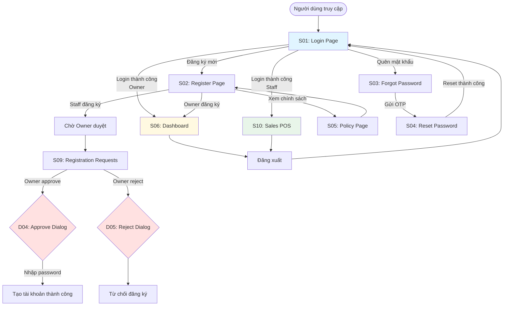
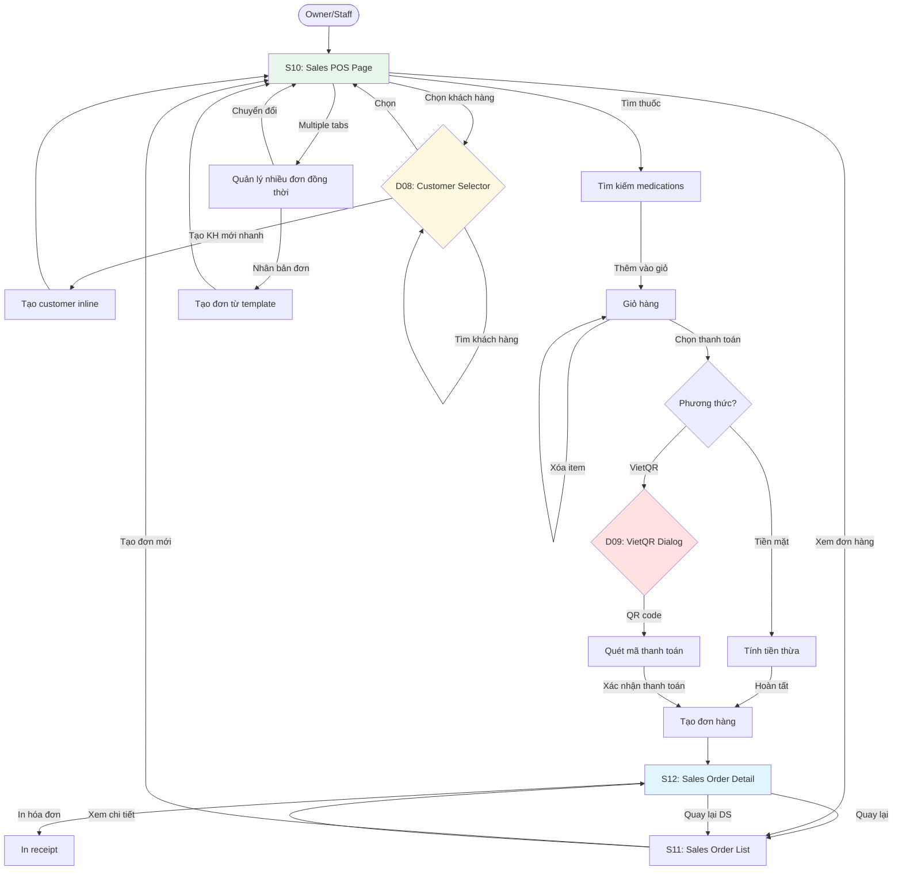
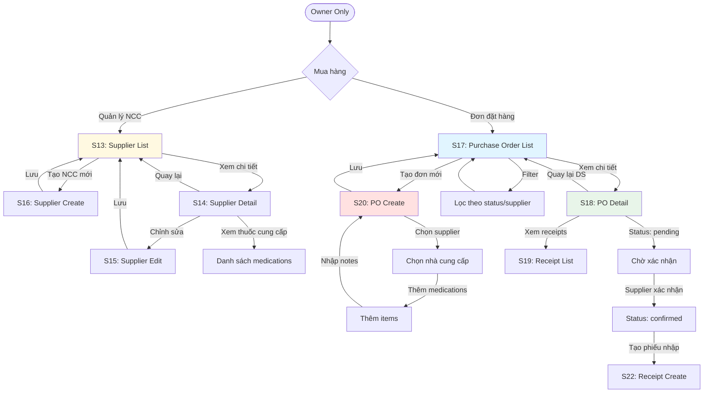
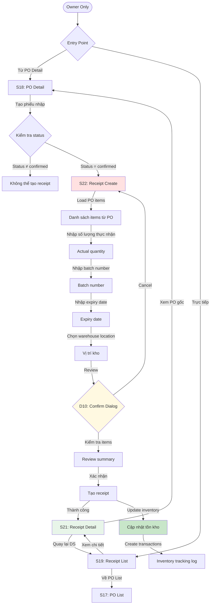
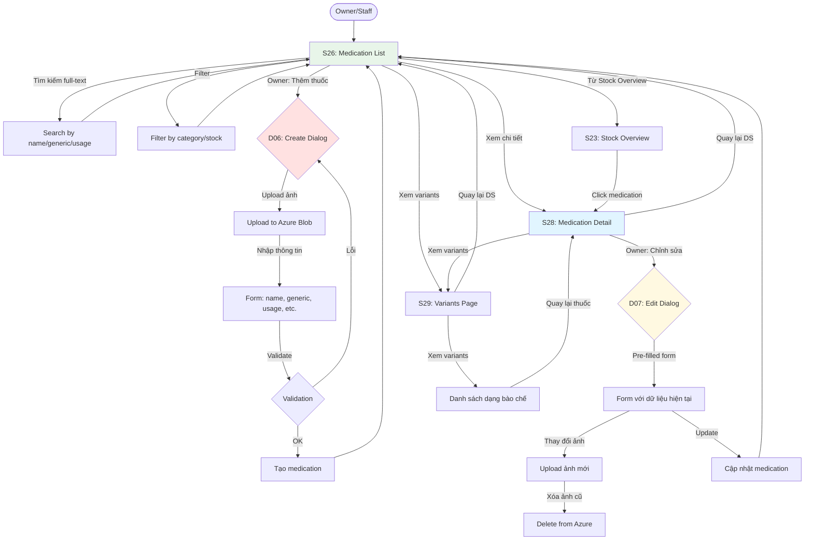
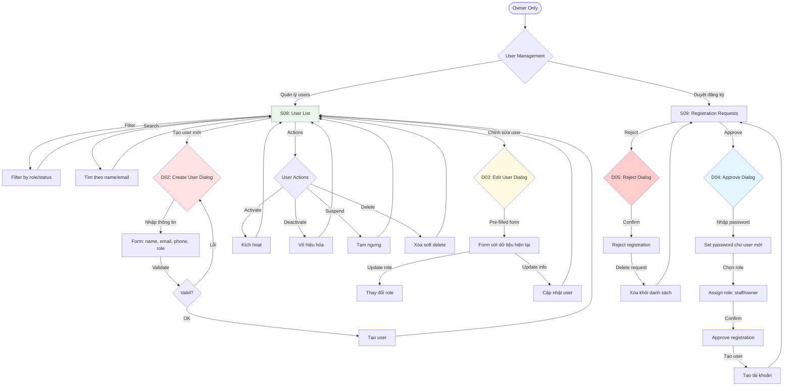
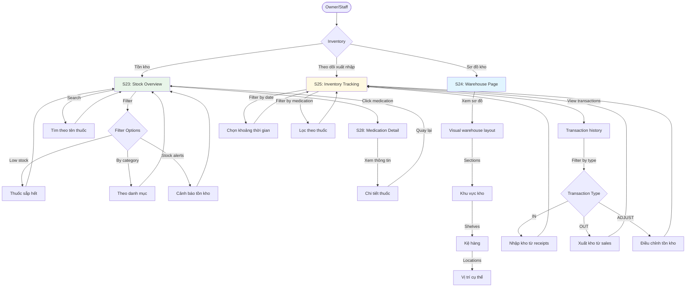
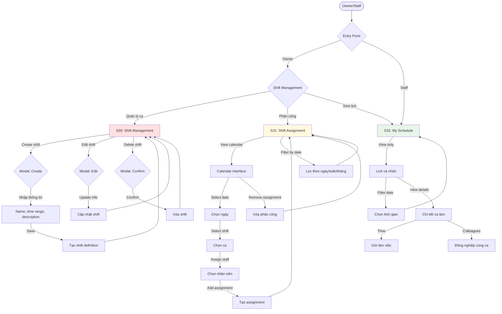
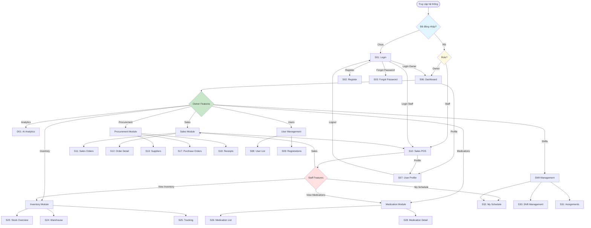

# Screen Flow Report - PharmaFlow

> Báo cáo chi tiết về các màn hình chức năng và luồng điều hướng trong hệ thống PharmaFlow
> 
> **Ngày tạo**: November 5, 2025
> **Phiên bản**: 1.0

---

## 📋 Mục lục
1. [Tổng quan hệ thống](#tổng-quan-hệ-thống)
2. [Danh sách Screens](#danh-sách-screens)
3. [Danh sách Actions](#danh-sách-actions)
4. [Sơ đồ phân quyền](#sơ-đồ-phân-quyền)

---

## Tổng quan hệ thống

### Roles trong hệ thống
- **Owner**: Chủ cửa hàng - Quyền quản trị toàn bộ hệ thống
- **Staff**: Nhân viên - Quyền hạn chế, chủ yếu bán hàng và xem kho
- **Public**: Người dùng chưa đăng nhập

### Tổng số screens
- **Protected Screens**: 32 màn hình (yêu cầu đăng nhập)
- **Public Screens**: 5 màn hình (không yêu cầu đăng nhập)
- **Dialog Screens**: 10 dialog phức tạp (được xem như màn hình con)
- **Total**: 47 màn hình (37 pages + 10 dialogs)

---

## Danh sách Screens

### PUBLIC SCREENS (5 screens)

#### S01. Login Page
- **Name**: Login Page
- **Path**: `/login`
- **Description**: Màn hình đăng nhập vào hệ thống
- **Required Roles**: None (Public)
- **Connected Screens**: 
  - S03 (Forgot Password Page) - Link "Quên mật khẩu"
  - S02 (Register Page) - Link "Đăng ký tài khoản"
  - S06 (Dashboard) - Sau khi đăng nhập thành công (Owner)
  - S10 (Sales POS Page) - Sau khi đăng nhập thành công (Staff)
- **Note**: PublicRoute - Redirect về dashboard nếu đã đăng nhập

#### S02. Register Page
- **Name**: Register Page
- **Path**: `/register`
- **Description**: Màn hình đăng ký tài khoản mới
- **Required Roles**: None (Public)
- **Connected Screens**: 
  - S01 (Login Page) - Link "Đã có tài khoản"
  - S05 (Policy Page) - Link xem chính sách
- **Note**: Đăng ký Owner tự động approve, Staff cần chờ duyệt

#### S03. Forgot Password Page
- **Name**: Forgot Password Page
- **Path**: `/forgot-password`
- **Description**: Màn hình yêu cầu reset mật khẩu qua email
- **Required Roles**: None (Public)
- **Connected Screens**: 
  - S04 (Reset Password Page) - Link "Đã có OTP"
  - S01 (Login Page) - Link "Quay lại đăng nhập"
- **Note**: Gửi OTP qua email

#### S04. Reset Password Page
- **Name**: Reset Password Page
- **Path**: `/reset-password`
- **Description**: Màn hình reset mật khẩu với OTP
- **Required Roles**: None (Public)
- **Connected Screens**: 
  - S01 (Login Page) - Sau khi reset thành công
  - S03 (Forgot Password Page) - Link "Gửi lại OTP"
- **Note**: Yêu cầu OTP từ email

#### S05. Policy Page
- **Name**: Policy Page
- **Path**: `/policy`
- **Description**: Màn hình hiển thị chính sách và điều khoản
- **Required Roles**: None (Public)
- **Connected Screens**: 
  - S02 (Register Page) - Link quay lại đăng ký
- **Note**: Hiển thị điều khoản sử dụng

---

### PROTECTED SCREENS (32 screens)

#### S06. Dashboard Page
- **Name**: Dashboard Page
- **Path**: `/dashboard`
- **Description**: Trang tổng quan với thống kê doanh thu, đơn hàng và báo cáo tháng
- **Required Roles**: Owner
- **Connected Screens**: 
  - S10 (Sales POS Page) - Quick action "Bán hàng"
  - S11 (Sales Order List Page) - Quick action "Đơn bán hàng"
  - S24 (Medication List Page) - Quick action "Quản lý thuốc"
  - S14 (Purchase Order List Page) - Quick action "Đơn đặt hàng"
  - S18 (Stock Overview Page) - Quick action "Tồn kho"
  - S08 (User List Page) - Quick action "Người dùng"
- **Note**: Staff được tự động redirect đến /sales khi login. Có AI Analytics Dialog để phân tích dữ liệu

#### S07. User Profile Page
- **Name**: User Profile Page
- **Path**: `/user-profile`
- **Description**: Trang thông tin cá nhân và đổi mật khẩu
- **Required Roles**: Owner, Staff (All authenticated users)
- **Connected Screens**: None
- **Note**: Truy cập từ header menu avatar

---

### USER MANAGEMENT MODULE (2 screens)

#### S08. User List Page
- **Name**: User List Page
- **Path**: `/users/list`
- **Description**: Danh sách người dùng với filter theo role, status và tìm kiếm
- **Required Roles**: Owner
- **Connected Screens**: None (Modal-based CRUD)
- **Note**: Chức năng: Create, Update, Delete, Activate, Deactivate, Suspend users

#### S09. Registration Requests Page
- **Name**: Registration Requests Page
- **Path**: `/users/registrations`
- **Description**: Danh sách yêu cầu đăng ký tài khoản Staff chờ duyệt
- **Required Roles**: Owner
- **Connected Screens**: None (Modal-based approval)
- **Note**: Owner approve/reject với password và role assignment

---

### SALES MODULE (3 screens)

#### S10. Sales POS Page
- **Name**: Sales POS Page
- **Path**: `/sales`
- **Description**: Màn hình bán hàng (Point of Sale) với giỏ hàng và thanh toán
- **Required Roles**: Owner, Staff
- **Connected Screens**: 
  - S11 (Sales Order List Page) - Button "Xem đơn hàng"
  - S12 (Sales Order Detail Page) - Sau khi tạo đơn thành công
- **Note**: Chọn thuốc, thêm vào giỏ, chọn khách hàng, thanh toán

#### S11. Sales Order List Page
- **Name**: Sales Order List Page
- **Path**: `/sales/orders`
- **Description**: Danh sách đơn bán hàng với filter theo trạng thái và ngày
- **Required Roles**: Owner, Staff
- **Connected Screens**: 
  - S10 (Sales POS Page) - Button "Tạo đơn hàng mới"
  - S12 (Sales Order Detail Page) - Click vào đơn hàng
- **Note**: Hiển thị tất cả đơn bán hàng đã tạo

#### S12. Sales Order Detail Page
- **Name**: Sales Order Detail Page
- **Path**: `/sales/orders/:id`
- **Description**: Chi tiết đơn bán hàng với thông tin khách hàng và items
- **Required Roles**: Owner, Staff
- **Connected Screens**: 
  - S11 (Sales Order List Page) - Button "Quay lại danh sách"
- **Note**: Hiển thị thông tin đầy đủ về đơn hàng

---

### PROCUREMENT MODULE (6 screens)

#### S13. Supplier List Page
- **Name**: Supplier List Page
- **Path**: `/suppliers`
- **Description**: Danh sách nhà cung cấp với tìm kiếm và phân trang
- **Required Roles**: Owner
- **Connected Screens**: 
  - S16 (Supplier Create Page) - Button "Thêm nhà cung cấp"
  - S14 (Supplier Detail Page) - Click vào nhà cung cấp
- **Note**: Hiển thị thông tin contact, email, phone

#### S14. Supplier Detail Page
- **Name**: Supplier Detail Page
- **Path**: `/suppliers/:id`
- **Description**: Chi tiết nhà cung cấp và danh sách thuốc cung cấp
- **Required Roles**: Owner
- **Connected Screens**: 
  - S13 (Supplier List Page) - Button "Quay lại"
  - S15 (Supplier Edit Page) - Button "Chỉnh sửa"
- **Note**: Hiển thị medications từ nhà cung cấp

#### S15. Supplier Edit Page
- **Name**: Supplier Edit Page
- **Path**: `/suppliers/:id/edit`
- **Description**: Form chỉnh sửa thông tin nhà cung cấp
- **Required Roles**: Owner
- **Connected Screens**: 
  - S13 (Supplier List Page) - Sau khi save thành công
- **Note**: Update name, contact, email, phone, address

#### S16. Supplier Create Page
- **Name**: Supplier Create Page
- **Path**: `/suppliers/create`
- **Description**: Form tạo nhà cung cấp mới
- **Required Roles**: Owner
- **Connected Screens**: 
  - S13 (Supplier List Page) - Sau khi tạo thành công
- **Note**: Validate form trước khi submit

#### S17. Purchase Order List Page
- **Name**: Purchase Order List Page
- **Path**: `/procurement/purchase-orders`
- **Description**: Danh sách đơn đặt hàng với filter theo status và supplier
- **Required Roles**: Owner
- **Connected Screens**: 
  - S20 (Purchase Order Create Page) - Button "Tạo đơn đặt hàng"
  - S18 (Purchase Order Detail Page) - Click vào đơn đặt hàng
- **Note**: Status: pending, confirmed, received, cancelled

#### S18. Purchase Order Detail Page
- **Name**: Purchase Order Detail Page
- **Path**: `/purchase-orders/:id`
- **Description**: Chi tiết đơn đặt hàng với items và supplier
- **Required Roles**: Owner
- **Connected Screens**: 
  - S17 (Purchase Order List Page) - Button "Quay lại danh sách"
  - S23 (Purchase Order Receipt Create Page) - Button "Tạo phiếu nhập"
- **Note**: Xem items, notes, tracking info. Tạo receipt nếu status confirmed

#### S19. Purchase Order Receipt List Page
- **Name**: Purchase Order Receipt List Page
- **Path**: `/procurement/receipts`
- **Description**: Danh sách phiếu nhập hàng (receipts)
- **Required Roles**: Owner
- **Connected Screens**: 
  - S17 (Purchase Order List Page) - Button "Đơn đặt hàng"
  - S21 (Purchase Order Receipt Detail Page) - Click vào phiếu nhập
- **Note**: Hiển thị receivedDate, warehouse, notes

#### S20. Purchase Order Create Page
- **Name**: Purchase Order Create Page
- **Path**: `/purchase-orders/create`
- **Description**: Form tạo đơn đặt hàng mới
- **Required Roles**: Owner
- **Connected Screens**: 
  - S17 (Purchase Order List Page) - Sau khi tạo thành công
- **Note**: Chọn supplier, thêm medications, nhập notes

#### S21. Purchase Order Receipt Detail Page
- **Name**: Purchase Order Receipt Detail Page
- **Path**: `/procurement/receipts/:id`
- **Description**: Chi tiết phiếu nhập hàng với items đã nhận
- **Required Roles**: Owner
- **Connected Screens**: 
  - S19 (Purchase Order Receipt List Page) - Button "Quay lại danh sách"
  - S18 (Purchase Order Detail Page) - Link "Xem đơn đặt hàng"
- **Note**: Hiển thị warehouse location, received items với batch numbers

#### S22. Purchase Order Receipt Create Page
- **Name**: Purchase Order Receipt Create Page
- **Path**: `/purchase-orders/:purchaseOrderId/receipts/create`
- **Description**: Form tạo phiếu nhập hàng cho đơn đặt hàng
- **Required Roles**: Owner
- **Connected Screens**: 
  - S21 (Purchase Order Receipt Detail Page) - Sau khi tạo thành công
  - S19 (Purchase Order Receipt List Page) - Sau khi tạo thành công
  - S18 (Purchase Order Detail Page) - Button "Quay lại đơn đặt hàng"
- **Note**: Nhập số lượng thực nhận, batch number, expiry date cho từng item

---

### INVENTORY MODULE (3 screens)

#### S23. Stock Overview Page
- **Name**: Stock Overview Page
- **Path**: `/inventory/stock`
- **Description**: Tổng quan tồn kho với filter và cảnh báo hết hàng
- **Required Roles**: Owner, Staff
- **Connected Screens**: 
  - S24 (Medication Detail Page) - Click vào thuốc
- **Note**: Hiển thị quantity, min stock level, stock alerts

#### S24. Warehouse Page
- **Name**: Warehouse Page (Sơ đồ kho)
- **Path**: `/inventory/warehouse`
- **Description**: Sơ đồ kho hàng trực quan theo vị trí
- **Required Roles**: Owner, Staff
- **Connected Screens**: None
- **Note**: Visual layout của warehouse với sections và shelves

#### S25. Inventory Tracking Page
- **Name**: Inventory Tracking Page
- **Path**: `/inventory/tracking`
- **Description**: Lịch sử nhập/xuất kho với filter
- **Required Roles**: Owner, Staff
- **Connected Screens**: None
- **Note**: Transaction log: IN (receipt), OUT (sale), ADJUST

---

### MEDICATION MODULE (5 screens)

#### S26. Medication List Page
- **Name**: Medication List Page
- **Path**: `/medications`
- **Description**: Danh sách thuốc với tìm kiếm full-text và filter
- **Required Roles**: Owner, Staff
- **Connected Screens**: 
  - S27 (Medication Form Page - Create) - Button "Thêm thuốc" (Owner only)
  - S28 (Medication Detail Page) - Click vào thuốc
  - S30 (Medication Variants Page) - Button "Xem variants"
- **Note**: Tìm kiếm theo name, genericName, category, usage

#### S27. Medication Form Page (Create/Edit)
- **Name**: Medication Form Page
- **Path**: `/medications/new` hoặc `/medications/edit/:id`
- **Description**: Form tạo mới hoặc chỉnh sửa thuốc
- **Required Roles**: Owner
- **Connected Screens**: 
  - S26 (Medication List Page) - Sau khi save thành công
- **Note**: Upload ảnh, nhập thông tin đầy đủ về thuốc

#### S28. Medication Detail Page
- **Name**: Medication Detail Page
- **Path**: `/medications/:id`
- **Description**: Chi tiết thuốc với thông tin đầy đủ và variants
- **Required Roles**: Owner, Staff
- **Connected Screens**: 
  - S26 (Medication List Page) - Button "Quay lại"
  - S30 (Medication Variants Page) - Button "Xem tất cả variants"
- **Note**: Hiển thị image, usage, contraindications, interactions

#### S29. Medication Variants Page
- **Name**: Medication Variants Page
- **Path**: `/medications/:id/variants`
- **Description**: Danh sách variants (dosage forms) của một thuốc
- **Required Roles**: Owner, Staff
- **Connected Screens**: 
  - S28 (Medication Detail Page) - Button "Quay lại thuốc"
  - S26 (Medication List Page) - Button "Danh sách thuốc"
- **Note**: Hiển thị các dạng bào chế: viên nén, viên nang, xi-rô, etc.

---

### SHIFT MANAGEMENT MODULE (3 screens)

#### S30. Shift Management Page
- **Name**: Shift Management Page
- **Path**: `/shifts/management`
- **Description**: Quản lý ca làm việc (tạo, sửa, xóa shifts)
- **Required Roles**: Owner
- **Connected Screens**: None (Modal-based CRUD)
- **Note**: Định nghĩa shifts: Morning, Afternoon, Evening với time ranges

#### S31. Shift Assignment Page
- **Name**: Shift Assignment Page
- **Path**: `/shifts/assignments`
- **Description**: Phân công ca làm việc cho nhân viên
- **Required Roles**: Owner
- **Connected Screens**: None (Calendar-based interface)
- **Note**: Assign staff to shifts on specific dates

#### S32. My Schedule Page
- **Name**: My Schedule Page
- **Path**: `/shifts/my-schedule`
- **Description**: Lịch làm việc cá nhân của user
- **Required Roles**: Owner, Staff
- **Connected Screens**: None
- **Note**: View only - xem ca đã được phân công

---

### DIALOG SCREENS (10 dialogs)

> **Note**: Các dialog sau được xem như màn hình con (sub-screens) vì chúng có nghiệp vụ phức tạp, form riêng biệt và logic xử lý độc lập.

#### D01. AI Analytics Dialog
- **Name**: AI Analytics Dialog
- **Parent Screen**: S06 (Dashboard Page)
- **Description**: Dialog phân tích AI với khuyến nghị mua hàng, insights và warnings
- **Required Roles**: Owner
- **Connected Screens**: None (Modal overlay)
- **Note**: Có tabs: Recommendations, Quick Insights, Warnings. Fetch data từ AI Analysis API với filter theo thời gian (30/60/90/180 days)

#### D02. Create User Dialog
- **Name**: Create User Dialog
- **Parent Screen**: S08 (User List Page)
- **Description**: Dialog tạo user mới với form validation
- **Required Roles**: Owner
- **Connected Screens**: S08 (User List Page) - Refresh sau khi tạo thành công
- **Note**: Form fields: name, email, phone, address, role. Validation với React Hook Form

#### D03. Edit User Dialog
- **Name**: Edit User Dialog
- **Parent Screen**: S08 (User List Page)
- **Description**: Dialog chỉnh sửa thông tin user
- **Required Roles**: Owner
- **Connected Screens**: S08 (User List Page) - Refresh sau khi update thành công
- **Note**: Pre-populated form với thông tin user hiện tại. Có thể update role

#### D04. Approve Registration Dialog
- **Name**: Approve Registration Dialog
- **Parent Screen**: S09 (Registration Requests Page)
- **Description**: Dialog xác nhận phê duyệt đăng ký với form nhập password và role
- **Required Roles**: Owner
- **Connected Screens**: S09 (Registration Requests Page) - Refresh list
- **Note**: AlertDialog với form input password cho user mới. Default role là Staff

#### D05. Reject Registration Dialog
- **Name**: Reject Registration Dialog
- **Parent Screen**: S09 (Registration Requests Page)
- **Description**: Dialog xác nhận từ chối yêu cầu đăng ký
- **Required Roles**: Owner
- **Connected Screens**: S09 (Registration Requests Page) - Remove từ list
- **Note**: AlertDialog confirmation. Hành động không thể hoàn tác

#### D06. Create Medication Dialog
- **Name**: Create Medication Dialog
- **Parent Screen**: S26 (Medication List Page)
- **Description**: Dialog tạo thuốc mới với form đầy đủ và upload ảnh
- **Required Roles**: Owner
- **Connected Screens**: S26 (Medication List Page) - Refresh sau khi tạo
- **Note**: Form phức tạp với image upload (Azure Blob), validation, generic name, usage instructions

#### D07. Edit Medication Dialog
- **Name**: Edit Medication Dialog
- **Parent Screen**: S26 (Medication List Page) hoặc S28 (Medication Detail Page)
- **Description**: Dialog chỉnh sửa thuốc với preview ảnh hiện tại
- **Required Roles**: Owner
- **Connected Screens**: S26 (Medication List Page) - Refresh
- **Note**: Pre-filled form, có thể thay đổi ảnh, xóa ảnh cũ

#### D08. Customer Selector Dialog
- **Name**: Customer Selector Dialog
- **Parent Screen**: S10 (Sales POS Page)
- **Description**: Dialog chọn khách hàng hoặc tạo khách hàng mới nhanh
- **Required Roles**: Owner, Staff
- **Connected Screens**: S10 (Sales POS Page) - Set customer cho order
- **Note**: Search customer, create new customer inline với quick form (name, email, phone)

#### D09. VietQR Payment Dialog
- **Name**: VietQR Payment Dialog
- **Parent Screen**: S10 (Sales POS Page)
- **Description**: Dialog hiển thị QR code thanh toán VietQR
- **Required Roles**: Owner, Staff
- **Connected Screens**: S12 (Sales Order Detail Page) - Sau khi thanh toán
- **Note**: Generate QR code với số tiền, thông tin đơn hàng. Có countdown timer

#### D10. Receipt Creation Confirmation Dialog
- **Name**: Receipt Creation Confirmation Dialog
- **Parent Screen**: S22 (Receipt Create Page)
- **Description**: Dialog xác nhận tạo phiếu nhập với summary items
- **Required Roles**: Owner
- **Connected Screens**: S21 (Receipt Detail Page) hoặc S19 (Receipt List Page)
- **Note**: Review items, batch numbers, expiry dates trước khi confirm

---

### SYSTEM SCREENS (1 screen)

#### S33. Not Found Page (404)
- **Name**: Not Found Page
- **Path**: `*` (catch-all route)
- **Description**: Trang hiển thị khi route không tồn tại
- **Required Roles**: None (Public)
- **Connected Screens**: 
  - S06 (Dashboard) - Link "Về Dashboard"
  - S01 (Login Page) - Link "Về Trang chủ"
- **Note**: Accessible to everyone

---

## Danh sách Actions

### AUTHENTICATION ACTIONS (10 actions)

| No   | Action Name           | Source Screen              | Destination Screen         | Precondition                  | Note                        |
| ---- | --------------------- | -------------------------- | -------------------------- | ----------------------------- | --------------------------- |
| A001 | Login                 | S01 (Login Page)           | S06 (Dashboard)            | Valid credentials, role=Owner | Owner redirect to dashboard |
| A002 | Login                 | S01 (Login Page)           | S10 (Sales POS Page)       | Valid credentials, role=Staff | Staff redirect to sales     |
| A003 | Go to Register        | S01 (Login Page)           | S02 (Register Page)        | None                          | Link "Đăng ký tài khoản"    |
| A004 | Go to Forgot Password | S01 (Login Page)           | S03 (Forgot Password Page) | None                          | Link "Quên mật khẩu"        |
| A005 | Register Owner        | S02 (Register Page)        | S06 (Dashboard)            | Valid form, role=Owner        | Auto approve & login        |
| A006 | Register Staff        | S02 (Register Page)        | S01 (Login Page)           | Valid form, role=Staff        | Pending approval message    |
| A007 | Go to Login           | S02 (Register Page)        | S01 (Login Page)           | None                          | Link "Đã có tài khoản"      |
| A008 | Send Reset OTP        | S03 (Forgot Password Page) | S04 (Reset Password Page)  | Valid email                   | OTP sent via email          |
| A009 | Reset Password        | S04 (Reset Password Page)  | S01 (Login Page)           | Valid OTP & new password      | Success message             |
| A010 | Logout                | Any Protected Screen       | S01 (Login Page)           | Authenticated                 | Clear token & storage       |

---

### DASHBOARD ACTIONS (6 actions)

| No   | Action Name                   | Source Screen   | Destination Screen             | Precondition | Note                       |
| ---- | ----------------------------- | --------------- | ------------------------------ | ------------ | -------------------------- |
| A011 | Quick Action: Sales           | S06 (Dashboard) | S10 (Sales POS Page)           | role=Owner   | Click "Bán hàng" card      |
| A012 | Quick Action: Orders          | S06 (Dashboard) | S11 (Sales Order List Page)    | role=Owner   | Click "Đơn bán hàng" card  |
| A013 | Quick Action: Medications     | S06 (Dashboard) | S26 (Medication List Page)     | role=Owner   | Click "Quản lý thuốc" card |
| A014 | Quick Action: Purchase Orders | S06 (Dashboard) | S17 (Purchase Order List Page) | role=Owner   | Click "Đơn đặt hàng" card  |
| A015 | Quick Action: Stock           | S06 (Dashboard) | S23 (Stock Overview Page)      | role=Owner   | Click "Tồn kho" card       |
| A016 | Quick Action: Users           | S06 (Dashboard) | S08 (User List Page)           | role=Owner   | Click "Người dùng" card    |

---

### SALES ACTIONS (6 actions)

| No   | Action Name        | Source Screen                 | Destination Screen            | Precondition                   | Note                        |
| ---- | ------------------ | ----------------------------- | ----------------------------- | ------------------------------ | --------------------------- |
| A017 | Create Sales Order | S10 (Sales POS Page)          | S12 (Sales Order Detail Page) | Cart has items, valid customer | Complete checkout           |
| A018 | View Orders        | S10 (Sales POS Page)          | S11 (Sales Order List Page)   | None                           | Button "Xem đơn hàng"       |
| A019 | Create New Order   | S11 (Sales Order List Page)   | S10 (Sales POS Page)          | None                           | Button "Tạo đơn hàng mới"   |
| A020 | View Order Detail  | S11 (Sales Order List Page)   | S12 (Sales Order Detail Page) | Order exists                   | Click on order row          |
| A021 | Back to Orders     | S12 (Sales Order Detail Page) | S11 (Sales Order List Page)   | None                           | Button "Quay lại danh sách" |
| A022 | Print Receipt      | S12 (Sales Order Detail Page) | None (Print dialog)           | Order exists                   | Print button                |

---

### SUPPLIER ACTIONS (9 actions)

| No   | Action Name        | Source Screen              | Destination Screen         | Precondition        | Note                       |
| ---- | ------------------ | -------------------------- | -------------------------- | ------------------- | -------------------------- |
| A023 | Create Supplier    | S13 (Supplier List Page)   | S16 (Supplier Create Page) | role=Owner          | Button "Thêm nhà cung cấp" |
| A024 | View Supplier      | S13 (Supplier List Page)   | S14 (Supplier Detail Page) | Supplier exists     | Click on supplier row      |
| A025 | Edit Supplier      | S14 (Supplier Detail Page) | S15 (Supplier Edit Page)   | role=Owner          | Button "Chỉnh sửa"         |
| A026 | Back to List       | S14 (Supplier Detail Page) | S13 (Supplier List Page)   | None                | Button "Quay lại"          |
| A027 | Update Supplier    | S15 (Supplier Edit Page)   | S13 (Supplier List Page)   | Valid form          | Save success               |
| A028 | Save New Supplier  | S16 (Supplier Create Page) | S13 (Supplier List Page)   | Valid form          | Create success             |
| A029 | Delete Supplier    | S13 (Supplier List Page)   | S13 (Supplier List Page)   | role=Owner, confirm | Soft delete                |
| A030 | Search Supplier    | S13 (Supplier List Page)   | S13 (Supplier List Page)   | None                | Filter by name/contact     |
| A031 | Cancel Create/Edit | S15/S16 (Edit/Create Page) | S13 (Supplier List Page)   | None                | Cancel button              |

---

### PURCHASE ORDER ACTIONS (15 actions)

| No   | Action Name           | Source Screen             | Destination Screen        | Precondition          | Note                      |
| ---- | --------------------- | ------------------------- | ------------------------- | --------------------- | ------------------------- |
| A032 | Create Purchase Order | S17 (PO List Page)        | S20 (PO Create Page)      | role=Owner            | Button "Tạo đơn đặt hàng" |
| A033 | View PO Detail        | S17 (PO List Page)        | S18 (PO Detail Page)      | PO exists             | Click on PO row           |
| A034 | Save New PO           | S20 (PO Create Page)      | S17 (PO List Page)        | Valid form, has items | Create success            |
| A035 | Back to PO List       | S18 (PO Detail Page)      | S17 (PO List Page)        | None                  | Button "Quay lại"         |
| A036 | Create Receipt        | S18 (PO Detail Page)      | S22 (Receipt Create Page) | PO status=confirmed   | Button "Tạo phiếu nhập"   |
| A037 | View Receipts         | S18 (PO Detail Page)      | S19 (Receipt List Page)   | None                  | Link "Xem phiếu nhập"     |
| A038 | View Receipt Detail   | S19 (Receipt List Page)   | S21 (Receipt Detail Page) | Receipt exists        | Click on receipt row      |
| A039 | Go to PO List         | S19 (Receipt List Page)   | S17 (PO List Page)        | None                  | Button "Đơn đặt hàng"     |
| A040 | Save Receipt          | S22 (Receipt Create Page) | S21 (Receipt Detail Page) | Valid form, has items | Create success            |
| A041 | Save Receipt (alt)    | S22 (Receipt Create Page) | S19 (Receipt List Page)   | Valid form, has items | Create success            |
| A042 | Back to PO            | S22 (Receipt Create Page) | S18 (PO Detail Page)      | None                  | Cancel button             |
| A043 | Back to Receipt List  | S21 (Receipt Detail Page) | S19 (Receipt List Page)   | None                  | Button "Quay lại"         |
| A044 | View Parent PO        | S21 (Receipt Detail Page) | S18 (PO Detail Page)      | PO exists             | Link "Xem đơn đặt hàng"   |
| A045 | Filter PO             | S17 (PO List Page)        | S17 (PO List Page)        | None                  | Filter by status/supplier |
| A046 | Search PO             | S17 (PO List Page)        | S17 (PO List Page)        | None                  | Search by code/notes      |

---

### INVENTORY ACTIONS (5 actions)

| No   | Action Name            | Source Screen                 | Destination Screen            | Precondition      | Note                          |
| ---- | ---------------------- | ----------------------------- | ----------------------------- | ----------------- | ----------------------------- |
| A047 | View Medication Detail | S23 (Stock Overview Page)     | S28 (Medication Detail Page)  | Medication exists | Click on stock item           |
| A048 | Filter Stock           | S23 (Stock Overview Page)     | S23 (Stock Overview Page)     | None              | Filter by low stock, category |
| A049 | Search Stock           | S23 (Stock Overview Page)     | S23 (Stock Overview Page)     | None              | Search by medication name     |
| A050 | View Warehouse Map     | S24 (Warehouse Page)          | S24 (Warehouse Page)          | None              | Interactive visualization     |
| A051 | Filter Tracking        | S25 (Inventory Tracking Page) | S25 (Inventory Tracking Page) | None              | Filter by type, date range    |

---

### MEDICATION ACTIONS (12 actions)

| No   | Action Name         | Source Screen                | Destination Screen           | Precondition            | Note                             |
| ---- | ------------------- | ---------------------------- | ---------------------------- | ----------------------- | -------------------------------- |
| A052 | Create Medication   | S26 (Medication List Page)   | S27 (Medication Form Page)   | role=Owner              | Button "Thêm thuốc"              |
| A053 | View Medication     | S26 (Medication List Page)   | S28 (Medication Detail Page) | Medication exists       | Click on medication row          |
| A054 | View Variants       | S26 (Medication List Page)   | S29 (Variants Page)          | Medication exists       | Button "Xem variants"            |
| A055 | Save New Medication | S27 (Medication Form Page)   | S26 (Medication List Page)   | Valid form, role=Owner  | Create success                   |
| A056 | Update Medication   | S27 (Medication Form Page)   | S26 (Medication List Page)   | Valid form, role=Owner  | Edit success                     |
| A057 | Cancel Form         | S27 (Medication Form Page)   | S26 (Medication List Page)   | None                    | Cancel button                    |
| A058 | Back to List        | S28 (Medication Detail Page) | S26 (Medication List Page)   | None                    | Button "Quay lại"                |
| A059 | View All Variants   | S28 (Medication Detail Page) | S29 (Variants Page)          | Medication has variants | Button "Xem tất cả variants"     |
| A060 | Back to Medication  | S29 (Variants Page)          | S28 (Medication Detail Page) | None                    | Button "Quay lại thuốc"          |
| A061 | Back to List        | S29 (Variants Page)          | S26 (Medication List Page)   | None                    | Button "Danh sách thuốc"         |
| A062 | Search Medication   | S26 (Medication List Page)   | S26 (Medication List Page)   | None                    | Full-text search                 |
| A063 | Filter Medication   | S26 (Medication List Page)   | S26 (Medication List Page)   | None                    | Filter by category, stock status |

---

### USER MANAGEMENT ACTIONS (8 actions)

| No   | Action Name          | Source Screen               | Destination Screen          | Precondition               | Note           |
| ---- | -------------------- | --------------------------- | --------------------------- | -------------------------- | -------------- |
| A064 | Create User          | S08 (User List Page)        | S08 (User List Page)        | role=Owner                 | Modal form     |
| A065 | Update User          | S08 (User List Page)        | S08 (User List Page)        | role=Owner                 | Modal form     |
| A066 | Delete User          | S08 (User List Page)        | S08 (User List Page)        | role=Owner, confirm        | Soft delete    |
| A067 | Activate User        | S08 (User List Page)        | S08 (User List Page)        | role=Owner                 | Status change  |
| A068 | Deactivate User      | S08 (User List Page)        | S08 (User List Page)        | role=Owner                 | Status change  |
| A069 | Suspend User         | S08 (User List Page)        | S08 (User List Page)        | role=Owner                 | Status change  |
| A070 | Approve Registration | S09 (Registration Requests) | S09 (Registration Requests) | role=Owner, valid password | Modal form     |
| A071 | Reject Registration  | S09 (Registration Requests) | S09 (Registration Requests) | role=Owner, confirm        | Delete request |

---

### SHIFT MANAGEMENT ACTIONS (8 actions)

| No   | Action Name           | Source Screen               | Destination Screen          | Precondition        | Note                    |
| ---- | --------------------- | --------------------------- | --------------------------- | ------------------- | ----------------------- |
| A072 | Create Shift          | S30 (Shift Management Page) | S30 (Shift Management Page) | role=Owner          | Modal form              |
| A073 | Update Shift          | S30 (Shift Management Page) | S30 (Shift Management Page) | role=Owner          | Modal form              |
| A074 | Delete Shift          | S30 (Shift Management Page) | S30 (Shift Management Page) | role=Owner, confirm | Delete shift definition |
| A075 | Assign Staff to Shift | S31 (Shift Assignment Page) | S31 (Shift Assignment Page) | role=Owner          | Calendar interaction    |
| A076 | Remove Assignment     | S31 (Shift Assignment Page) | S31 (Shift Assignment Page) | role=Owner          | Calendar interaction    |
| A077 | View My Schedule      | S32 (My Schedule Page)      | S32 (My Schedule Page)      | Authenticated       | Read-only calendar      |
| A078 | Filter by Date        | S31 (Shift Assignment Page) | S31 (Shift Assignment Page) | role=Owner          | Date picker             |
| A079 | Filter by Date        | S32 (My Schedule Page)      | S32 (My Schedule Page)      | Authenticated       | Date picker             |

---

### PROFILE ACTIONS (2 actions)

| No   | Action Name     | Source Screen           | Destination Screen      | Precondition                   | Note                        |
| ---- | --------------- | ----------------------- | ----------------------- | ------------------------------ | --------------------------- |
| A080 | Update Profile  | S07 (User Profile Page) | S07 (User Profile Page) | Authenticated, valid form      | Update name, email, phone   |
| A081 | Change Password | S07 (User Profile Page) | S07 (User Profile Page) | Authenticated, valid passwords | Old password + new password |

---

### NAVIGATION ACTIONS (5 actions)

| No   | Action Name     | Source Screen        | Destination Screen      | Precondition  | Note                |
| ---- | --------------- | -------------------- | ----------------------- | ------------- | ------------------- |
| A082 | Go to Dashboard | Any Protected Screen | S06 (Dashboard)         | role=Owner    | Sidebar menu        |
| A083 | Go to Profile   | Any Protected Screen | S07 (User Profile Page) | Authenticated | Header avatar menu  |
| A084 | Go to 404       | S33 (404 Page)       | S06 (Dashboard)         | None          | Link "Về Dashboard" |
| A085 | Go to Home      | S33 (404 Page)       | S01 (Login Page)        | None          | Link "Về Trang chủ" |
| A086 | Browser Back    | Any Screen           | Previous Screen         | None          | Browser back button |

---

### DIALOG ACTIONS (15 actions)

| No   | Action Name              | Source Screen                  | Destination Screen             | Precondition                                  | Note                      |
| ---- | ------------------------ | ------------------------------ | ------------------------------ | --------------------------------------------- | ------------------------- |
| A087 | Open AI Analytics        | S06 (Dashboard)                | D01 (AI Analytics Dialog)      | role=Owner                                    | Button "AI Analytics"     |
| A088 | Refresh AI Data          | D01 (AI Analytics Dialog)      | D01 (AI Analytics Dialog)      | None                                          | Reload recommendations    |
| A089 | Change Time Range        | D01 (AI Analytics Dialog)      | D01 (AI Analytics Dialog)      | None                                          | Filter: 30/60/90/180 days |
| A090 | Open Create User         | S08 (User List Page)           | D02 (Create User Dialog)       | role=Owner                                    | Button "Add User"         |
| A091 | Submit Create User       | D02 (Create User Dialog)       | S08 (User List Page)           | Valid form                                    | Refresh user list         |
| A092 | Open Edit User           | S08 (User List Page)           | D03 (Edit User Dialog)         | role=Owner                                    | Click edit button         |
| A093 | Submit Edit User         | D03 (Edit User Dialog)         | S08 (User List Page)           | Valid form                                    | Refresh user list         |
| A094 | Open Approve Dialog      | S09 (Registration Requests)    | D04 (Approve Dialog)           | role=Owner                                    | Click approve button      |
| A095 | Confirm Approve          | D04 (Approve Dialog)           | S09 (Registration Requests)    | Valid password                                | Refresh requests          |
| A096 | Open Reject Dialog       | S09 (Registration Requests)    | D05 (Reject Dialog)            | role=Owner                                    | Click reject button       |
| A097 | Confirm Reject           | D05 (Reject Dialog)            | S09 (Registration Requests)    | Confirm action                                | Remove from list          |
| A098 | Open Create Medication   | S26 (Medication List Page)     | D06 (Create Medication Dialog) | role=Owner                                    | Button "Add Medication"   |
| A099 | Submit Create Medication | D06 (Create Medication Dialog) | S26 (Medication List Page)     | Valid form, image uploaded                    | Refresh list              |
| A100 | Open Edit Medication     | S26/S28                        | D07 (Edit Medication Dialog)   | role=Owner                                    | Click edit button         |
| A101 | Submit Edit Medication   | D07 (Edit Medication Dialog)   | S26 (Medication List Page)     | Valid form                                    | Refresh list              |
| A102 | Open Customer Selector   | S10 (Sales POS Page)           | D08 (Customer Selector Dialog) | None                                          | Button "Select Customer"  |
| A103 | Select Customer          | D08 (Customer Selector Dialog) | S10 (Sales POS Page)           | Customer exists                               | Set customer              |
| A104 | Create Quick Customer    | D08 (Customer Selector Dialog) | S10 (Sales POS Page)           | Valid quick form                              | Create & set customer     |
| A105 | Open VietQR Payment      | S10 (Sales POS Page)           | D09 (VietQR Payment Dialog)    | Cart has items, payment_method=mobile_payment | Generate QR code          |
| A106 | Complete VietQR Payment  | D09 (VietQR Payment Dialog)    | S12 (Sales Order Detail Page)  | Payment confirmed                             | Create order              |
| A107 | Open Receipt Confirm     | S22 (Receipt Create Page)      | D10 (Receipt Confirm Dialog)   | Valid items                                   | Review before submit      |
| A108 | Confirm Create Receipt   | D10 (Receipt Confirm Dialog)   | S21 (Receipt Detail Page)      | Valid form                                    | Create receipt            |

---

## Dialog Flow Summary

### Dialog Complexity Matrix

| Dialog | Parent Screen         | Type         | Lines of Code | API Calls                     | Form Fields | Complexity |
| ------ | --------------------- | ------------ | ------------- | ----------------------------- | ----------- | ---------- |
| D01    | Dashboard             | Analytics    | ~592          | 2 (recommendations, insights) | 1 filter    | High       |
| D02    | User List             | Form         | ~150          | 1 (create user)               | 5           | Medium     |
| D03    | User List             | Form         | ~191          | 1 (update user)               | 5           | Medium     |
| D04    | Registration Requests | Confirmation | ~80           | 1 (approve)                   | 2           | Low        |
| D05    | Registration Requests | Confirmation | ~60           | 1 (reject)                    | 0           | Low        |
| D06    | Medication List       | Form         | ~215          | 2 (create, upload)            | 8+          | High       |
| D07    | Medication Detail     | Form         | ~215          | 2 (update, upload)            | 8+          | High       |
| D08    | Sales POS             | Selector     | ~180          | 2 (search, create)            | 3+          | Medium     |
| D09    | Sales POS             | Payment      | ~250          | 1 (create order)              | 0           | Medium     |
| D10    | Receipt Create        | Confirmation | ~120          | 1 (create receipt)            | 0           | Low        |

**Total Dialog Code**: ~2,053 lines  
**Average Complexity**: Medium-High  
**Most Complex**: D01 (AI Analytics), D06/D07 (Medication Forms)

---

## Sơ đồ phân quyền

### Screens theo Role

#### Owner (Full Access) - 42 screens (32 pages + 10 dialogs)
```
✅ Dashboard (S06)
  ↳ D01 (AI Analytics Dialog)
✅ User Management (S08, S09)
  ↳ D02 (Create User Dialog)
  ↳ D03 (Edit User Dialog)
  ↳ D04 (Approve Registration Dialog)
  ↳ D05 (Reject Registration Dialog)
✅ Profile (S07)
✅ Sales (S10, S11, S12)
  ↳ D08 (Customer Selector Dialog)
  ↳ D09 (VietQR Payment Dialog)
✅ Procurement (S13-S22) - 10 screens
  ↳ D10 (Receipt Confirmation Dialog)
✅ Inventory (S23, S24, S25)
✅ Medications (S26, S27, S28, S29)
  ↳ D06 (Create Medication Dialog)
  ↳ D07 (Edit Medication Dialog)
✅ Shift Management (S30, S31, S32)
```

#### Staff (Limited Access) - 11 screens (9 pages + 2 dialogs)
```
✅ Profile (S07)
✅ Sales (S10, S11, S12)
  ↳ D08 (Customer Selector Dialog)
  ↳ D09 (VietQR Payment Dialog)
✅ Inventory (S23, S24, S25) - View only
✅ Medications (S26, S28, S29) - View only (cannot create/edit)
✅ My Schedule (S32)
```

#### Public (No Authentication) - 5 screens
```
✅ Login (S01)
✅ Register (S02)
✅ Forgot Password (S03)
✅ Reset Password (S04)
✅ Policy (S05)
```

---

### Feature Access Matrix

| Feature Module        | Owner  | Staff  | Public |
| --------------------- | ------ | ------ | ------ |
| Dashboard & Analytics | ✅ Full | ❌      | ❌      |
| User Management       | ✅ Full | ❌      | ❌      |
| Registration Approval | ✅ Full | ❌      | ❌      |
| Sales (POS)           | ✅ Full | ✅ Full | ❌      |
| Sales Orders View     | ✅ Full | ✅ View | ❌      |
| Suppliers             | ✅ Full | ❌      | ❌      |
| Purchase Orders       | ✅ Full | ❌      | ❌      |
| Receipts              | ✅ Full | ❌      | ❌      |
| Stock Overview        | ✅ Full | ✅ View | ❌      |
| Warehouse Map         | ✅ Full | ✅ View | ❌      |
| Inventory Tracking    | ✅ Full | ✅ View | ❌      |
| Medications View      | ✅ Full | ✅ View | ❌      |
| Medications CRUD      | ✅ Full | ❌      | ❌      |
| Shift Management      | ✅ Full | ❌      | ❌      |
| Shift Assignment      | ✅ Full | ❌      | ❌      |
| My Schedule           | ✅ View | ✅ View | ❌      |
| Profile Management    | ✅ Full | ✅ Full | ❌      |

---

## Ghi chú kỹ thuật

### Authentication Flow
1. **Login** → Store token & user in localStorage
2. **ProtectedRoute** → Check token, redirect to login if missing
3. **PublicRoute** → Check token, redirect to dashboard if present
4. **Role-based redirect**: Owner → dashboard, Staff → sales

### Navigation Pattern
- **Primary Navigation**: Sidebar menu (role-based visibility)
- **Secondary Navigation**: Breadcrumbs, back buttons
- **Quick Actions**: Dashboard cards (owner only)
- **Contextual Navigation**: Inline links in detail pages
- **Dialog Navigation**: Modal overlays cho CRUD operations và confirmations

### Dialog Architecture
**Criteria for Dialog as Screen:**
1. **Complex Business Logic**: Form validation, API calls, state management
2. **Independent Workflow**: Có thể hoàn thành task độc lập
3. **Significant User Interaction**: Multi-step forms, search, selection
4. **Data Transformation**: Create/Edit/Delete operations với data processing

**Dialog Categories:**
- **Form Dialogs (5)**: D02, D03, D06, D07, D08 - CRUD operations
- **Confirmation Dialogs (3)**: D04, D05, D10 - Action confirmations với validation
- **Analytics Dialogs (1)**: D01 - AI-powered data visualization với tabs
- **Payment Dialogs (1)**: D09 - QR code generation và payment flow

**Benefits:**
- ✅ Faster UX - No full page reload
- ✅ Context Preservation - Stay on current page
- ✅ Multi-tasking - Can switch between orders (POS)
- ✅ Reduced Navigation - Less clicks to complete tasks

### State Management
- **Authentication**: localStorage (token, user)
- **API State**: TanStack Query (caching, refetching)
- **Local State**: React useState for forms and UI
- **No Redux**: Simple state management approach

### API Integration
- **Axios Instance**: With interceptors for auth
- **Auto Refresh**: Token refresh on 401
- **Error Handling**: Centralized in axios interceptors
- **Loading States**: Per-query via TanStack Query

### Key Features
- **Full-text Search**: Medications (name, genericName, usage)
- **File Upload**: Medication images (Azure Blob Storage)
- **Audit Logging**: All CRUD operations tracked
- **Responsive Design**: Mobile-friendly UI
- **Real-time Updates**: Query invalidation on mutations
- **AI-Powered Analytics**: Purchase recommendations, insights, warnings
- **VietQR Integration**: QR code payment với real-time generation
- **Modal-based CRUD**: 10 complex dialogs cho workflows nhanh
- **Multi-tab Orders**: Sales POS hỗ trợ multiple orders đồng thời
- **Inline Customer Creation**: Quick customer form trong sales flow

---

## Tổng kết

### Statistics
- **Total Screens**: 47 (32 protected pages + 5 public pages + 10 dialog screens)
- **Total Actions**: 108 actions (86 page actions + 22 dialog actions)
- **Modules**: 9 modules (Auth, Dashboard, Sales, Procurement, Inventory, Medications, Users, Shifts, System)
- **Roles**: 2 roles (Owner, Staff) + Public
- **Complex Dialogs**: 10 dialog screens với business logic độc lập

### Coverage
- ✅ **Authentication & Authorization**: Complete
- ✅ **Sales Management**: Complete
- ✅ **Procurement**: Complete (PO + Receipts)
- ✅ **Inventory Management**: Complete
- ✅ **Medication Management**: Complete with variants
- ✅ **User Management**: Complete with approval flow
- ✅ **Shift Management**: Complete

### Development Status
- **Implementation**: Production-ready
- **Testing**: Unit tests with Vitest
- **Documentation**: Comprehensive guides available
- **Deployment**: Docker + Azure ready

---

## Screen Flow Diagrams

### Workflow Overview

Hệ thống PharmaFlow có **8 luồng làm việc chính**:

1. **Authentication Flow** - Đăng nhập, đăng ký, quên mật khẩu
2. **Sales Flow** - Bán hàng POS và quản lý đơn
3. **Procurement Flow** - Quản lý nhà cung cấp và đơn đặt hàng
4. **Receipt Flow** - Nhập hàng và quản lý kho
5. **Medication Management Flow** - Quản lý thuốc
6. **User Management Flow** - Quản lý người dùng
7. **Inventory Flow** - Quản lý tồn kho
8. **Shift Management Flow** - Quản lý ca làm việc

---

### 1. Authentication Flow



---

### 2. Sales Flow (POS & Orders)



---

### 3. Procurement Flow (Suppliers & Purchase Orders)



---

### 4. Receipt Flow (Warehouse Receiving)



---

### 5. Medication Management Flow



---

### 6. User Management Flow



---

### 7. Inventory Flow



---

### 8. Shift Management Flow



---

### 9. Dashboard & Analytics Flow (Owner Only)

```mermaid
flowchart TD
    Start([Owner]) --> S06[S06: Dashboard]
    
    S06 -->|View stats| Stats[Thống kê tổng quan]
    Stats -->|Total orders| Orders[Tổng đơn hàng]
    Stats -->|Revenue| Revenue[Doanh thu]
    Stats -->|Avg order| AvgOrder[Đơn hàng trung bình]
    Stats -->|Top products| TopProd[Sản phẩm bán chạy]
    
    S06 -->|Month selector| MonthSelect[Chọn tháng/năm]
    MonthSelect -->|Previous| PrevMonth[Tháng trước]
    MonthSelect -->|Next| NextMonth[Tháng sau]
    MonthSelect -->|Current| CurrentMonth[Tháng hiện tại]
    
    PrevMonth --> S06
    NextMonth --> S06
    CurrentMonth --> S06
    
    S06 -->|AI Analytics| D01{D01: AI Analytics Dialog}
    D01 -->|Tab: Recommendations| TabRec[Purchase Recommendations]
    D01 -->|Tab: Quick Insights| TabIns[Quick Insights]
    D01 -->|Tab: Warnings| TabWarn[Warnings & Alerts]
    
    TabRec -->|View by priority| PrioFilter{Priority}
    PrioFilter -->|HIGH| HighPrio[Ưu tiên cao]
    PrioFilter -->|MEDIUM| MedPrio[Ưu tiên trung bình]
    PrioFilter -->|LOW| LowPrio[Ưu tiên thấp]
    
    HighPrio --> TabRec
    MedPrio --> TabRec
    LowPrio --> TabRec
    
    TabRec -->|Medication info| MedDetail[Chi tiết thuốc]
    MedDetail -->|Stock info| StockInfo[Tồn kho hiện tại]
    MedDetail -->|Sales trend| Trend[Xu hướng bán]
    MedDetail -->|Recommended qty| RecommendQty[Số lượng đề xuất]
    
    TabIns -->|Summary| Summary[Tổng quan insights]
    Summary -->|Revenue analysis| RevenueAnal[Phân tích doanh thu]
    Summary -->|Sales patterns| SalesPattern[Mẫu bán hàng]
    Summary -->|Customer behavior| CustBehavior[Hành vi khách hàng]
    
    TabWarn -->|Expiring soon| Expiring[Sắp hết hạn]
    TabWarn -->|Low stock| LowStockWarn[Tồn kho thấp]
    TabWarn -->|Slow moving| SlowMoving[Hàng ế]
    
    D01 -->|Refresh data| RefreshAI[Refresh AI analysis]
    RefreshAI --> D01
    
    D01 -->|Change time range| TimeRange[30/60/90/180 days]
    TimeRange --> D01
    
    S06 -->|Quick actions| QuickActions{Quick Actions}
    QuickActions -->|Bán hàng| S10[S10: Sales POS]
    QuickActions -->|Đơn bán hàng| S11[S11: Sales Orders]
    QuickActions -->|Quản lý thuốc| S26[S26: Medications]
    QuickActions -->|Đơn đặt hàng| S17[S17: Purchase Orders]
    QuickActions -->|Tồn kho| S23[S23: Stock Overview]
    QuickActions -->|Người dùng| S08[S08: User List]
    
    S06 -->|Recent activities| Activities[Hoạt động gần đây]
    Activities -->|Purchase receipts| Receipts[Phiếu nhập mới]
    Activities -->|Sales orders| SalesOrders[Đơn bán hàng mới]
    
    style S06 fill:#fff9e1
    style D01 fill:#e1f5ff
    style TabRec fill:#c8e6c9
    style TabWarn fill:#ffcccc
```



---

### 10. Complete User Journey Map



---

### Workflow Summary Table

| #   | Workflow Name       | Entry Points | Key Screens | Dialogs  | Complexity | User Roles                 |
| --- | ------------------- | ------------ | ----------- | -------- | ---------- | -------------------------- |
| 1   | Authentication      | S01          | S01-S05     | D04, D05 | Medium     | Public, Owner              |
| 2   | Sales (POS)         | S10          | S10-S12     | D08, D09 | High       | Owner, Staff               |
| 3   | Procurement         | S13, S17     | S13-S20     | -        | High       | Owner                      |
| 4   | Receipt             | S18, S19     | S18-S22     | D10      | High       | Owner                      |
| 5   | Medication Mgmt     | S26          | S26-S29     | D06, D07 | Medium     | Owner (CRUD), Staff (View) |
| 6   | User Management     | S08, S09     | S08, S09    | D02-D05  | Medium     | Owner                      |
| 7   | Inventory           | S23-S25      | S23-S25     | -        | Low        | Owner, Staff               |
| 8   | Shift Management    | S30-S32      | S30-S32     | -        | Medium     | Owner (Mgmt), Staff (View) |
| 9   | Dashboard Analytics | S06          | S06         | D01      | High       | Owner                      |

**Total Workflows**: 9 luồng chính  
**Most Complex**: Sales (POS), Procurement, Receipt, Dashboard Analytics  
**Most Used**: Sales (Owner + Staff), Inventory (Owner + Staff)  
**Owner Exclusive**: Procurement, Receipt, User Management, Shift Management (CRUD)

---

**Report Generated**: November 5, 2025  
**System Version**: 1.0  
**Last Updated**: November 5, 2025
