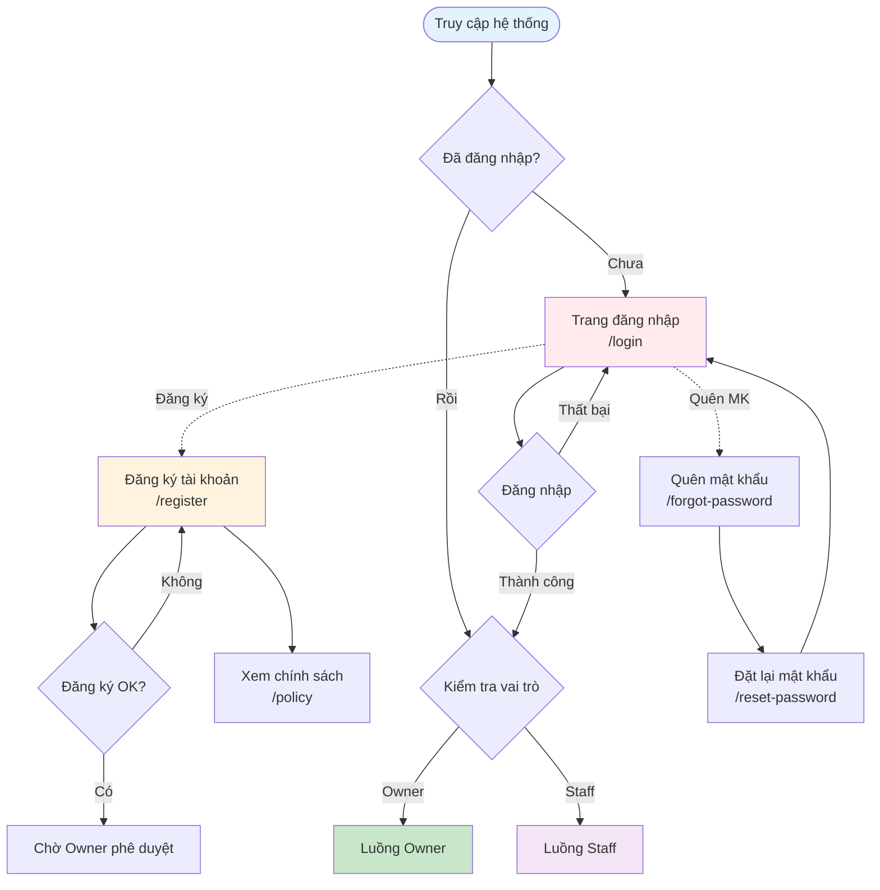
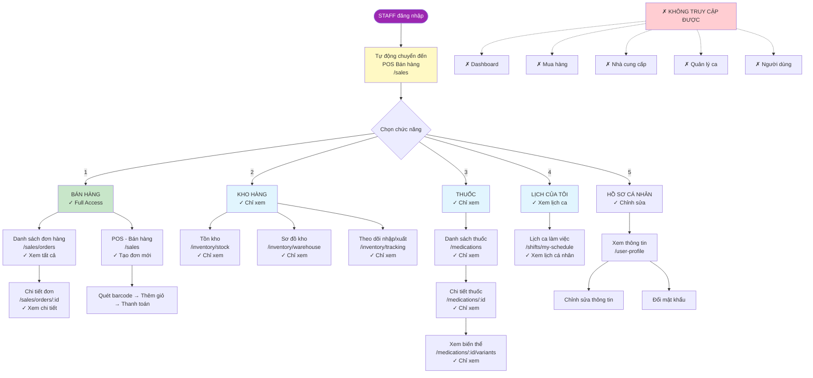
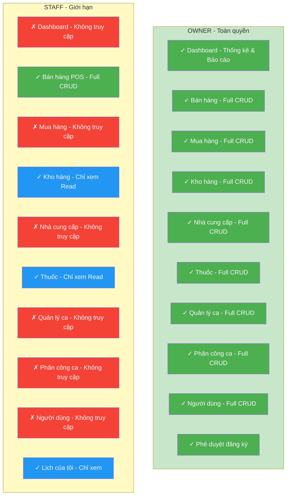

# Screen Flow - PharmaFlow System

## Sơ đồ luồng màn hình của hệ thống quản lý nhà thuốc PharmaFlow

---

## 1. Luồng Authentication (Đăng nhập/Đăng ký)

---

## 2. Luồng Owner (Quản lý toàn bộ hệ thống)

```mermaid
graph TB
    Owner([OWNER đăng nhập]) --> Dashboard[Dashboard<br/>/dashboard]

    Dashboard --> Stats[Xem thống kê tháng]
    Dashboard --> TopMeds[Top thuốc bán chạy]
    Dashboard --> Receipts[Phiếu nhập gần đây]
    Dashboard --> QuickActions{4 Thao tác nhanh}

    %% Quick Actions từ Dashboard - Navigate đến trang thực tế
    QuickActions -->|1. Bán hàng| Sales1[POS - Bán hàng<br/>/sales]
    QuickActions -->|2. Kho hàng| Inv1[Tồn kho<br/>/inventory/stock]
    QuickActions -->|3. Thuốc| Med1[Danh sách thuốc<br/>/medications]
    QuickActions -->|4. Báo cáo| QA4[AI Analytics Dialog]

    %% Sidebar Menu - 8 modules chính
    Dashboard --> Sidebar{Sidebar Menu}

    Sidebar -->|1| SalesMenu[BÁN HÀNG]
    Sidebar -->|2| ProcMenu[MUA HÀNG]
    Sidebar -->|3| InvMenu[KHO HÀNG]
    Sidebar -->|4| SupMenu[NHÀ CUNG CẤP]
    Sidebar -->|5| MedMenu[THUỐC]
    Sidebar -->|6| ShiftMenu[CA LÀM VIỆC]
    Sidebar -->|7| UserMenu[NGƯỜI DÙNG]
    Sidebar -->|8| Profile[Hồ sơ cá nhân]

    %% Bán hàng - Sub menu
    SalesMenu --> Sales1
    SalesMenu --> Sales2[Danh sách đơn hàng<br/>/sales/orders]
    Sales2 --> Sales3[Chi tiết đơn<br/>/sales/orders/:id]

    %% Mua hàng - Sub menu
    ProcMenu --> Proc1[Đơn đặt hàng<br/>/procurement/purchase-orders]
    ProcMenu --> Proc2[Phiếu nhập kho<br/>/procurement/receipts]
    Proc1 --> Proc3[Tạo đơn mới<br/>/purchase-orders/create]
    Proc1 --> Proc4[Chi tiết đơn<br/>/purchase-orders/:id]
    Proc4 --> Proc5[Tạo phiếu nhập<br/>/purchase-orders/:id/receipts/create]
    Proc2 --> Proc6[Chi tiết phiếu<br/>/procurement/receipts/:id]

    %% Kho hàng - Sub menu
    InvMenu --> Inv1
    InvMenu --> Inv2[Sơ đồ kho<br/>/inventory/warehouse]
    InvMenu --> Inv3[Theo dõi nhập/xuất<br/>/inventory/tracking]

    %% Nhà cung cấp - Direct navigation
    SupMenu --> Sup1[Danh sách NCC<br/>/suppliers]
    Sup1 --> Sup2[Tạo mới<br/>/suppliers/create]
    Sup1 --> Sup3[Chi tiết NCC<br/>/suppliers/:id]
    Sup3 --> Sup4[Chỉnh sửa<br/>/suppliers/:id/edit]

    %% Thuốc - Direct navigation
    MedMenu --> Med1
    Med1 --> Med2[Tạo mới<br/>/medications/new]
    Med1 --> Med3[Chi tiết<br/>/medications/:id]
    Med3 --> Med4[Chỉnh sửa<br/>/medications/edit/:id]
    Med3 --> Med5[Quản lý biến thể<br/>/medications/:id/variants]

    %% Ca làm việc - Sub menu
    ShiftMenu --> Shift1[Quản lý ca<br/>/shifts/management]
    ShiftMenu --> Shift2[Phân công ca<br/>/shifts/assignments]
    ShiftMenu --> Shift3[Lịch của tôi<br/>/shifts/my-schedule]

    %% Người dùng - Sub menu
    UserMenu --> User1[Danh sách user<br/>/users/list]
    UserMenu --> User2[Chờ phê duyệt<br/>/users/registrations]

    %% Profile - Direct navigation
    Profile --> Prof1[Xem thông tin<br/>/user-profile]
    Prof1 --> Prof2[Chỉnh sửa thông tin]
    Prof1 --> Prof3[Đổi mật khẩu]

    style Owner fill:#4caf50,color:#fff
    style Dashboard fill:#fff9c4
    style QuickActions fill:#ffe0b2
    style QA4 fill:#ff9800,color:#fff
    style Sidebar fill:#e1f5fe
    style Sales1 fill:#c8e6c9
    style Med1 fill:#c8e6c9
    style Inv1 fill:#c8e6c9
```

---

## 3. Luồng Staff (Nhân viên bán hàng)

---

## 4. So sánh quyền truy cập Owner vs Staff

---

---

## 5. Tóm tắt Routes theo vai trò

### Public Routes (Không cần đăng nhập)

- `/login` - Đăng nhập
- `/register` - Đăng ký
- `/forgot-password` - Quên mật khẩu
- `/reset-password` - Đặt lại mật khẩu
- `/policy` - Chính sách sử dụng

### Owner Routes (Toàn quyền)

#### Dashboard

- `/dashboard` - Trang tổng quan, thống kê, báo cáo

#### Bán hàng

- `/sales` - POS bán hàng
- `/sales/orders` - Danh sách đơn hàng
- `/sales/orders/:id` - Chi tiết đơn hàng

#### Mua hàng

- `/procurement/purchase-orders` - Danh sách đơn đặt
- `/purchase-orders/create` - Tạo đơn đặt mới
- `/purchase-orders/:id` - Chi tiết đơn đặt
- `/purchase-orders/:id/receipts/create` - Tạo phiếu nhập
- `/procurement/receipts` - Danh sách phiếu nhập
- `/procurement/receipts/:id` - Chi tiết phiếu nhập

#### Kho hàng

- `/inventory/stock` - Tồn kho
- `/inventory/warehouse` - Sơ đồ kho
- `/inventory/tracking` - Theo dõi nhập/xuất

#### Nhà cung cấp

- `/suppliers` - Danh sách NCC
- `/suppliers/create` - Tạo NCC mới
- `/suppliers/:id` - Chi tiết NCC
- `/suppliers/:id/edit` - Chỉnh sửa NCC

#### Thuốc

- `/medications` - Danh sách thuốc (CRUD)
- `/medications/new` - Tạo thuốc mới
- `/medications/:id` - Chi tiết thuốc
- `/medications/edit/:id` - Chỉnh sửa thuốc
- `/medications/:id/variants` - Quản lý biến thể

#### Ca làm việc

- `/shifts/management` - Quản lý ca
- `/shifts/assignments` - Phân công ca
- `/shifts/my-schedule` - Lịch của tôi

#### Người dùng

- `/users/list` - Danh sách người dùng
- `/users/registrations` - Phê duyệt đăng ký

#### Hồ sơ

- `/user-profile` - Hồ sơ cá nhân

### Staff Routes (Giới hạn)

#### Bán hàng (Full Access)

- `/sales` - POS bán hàng ✓ CRUD
- `/sales/orders` - Danh sách đơn hàng ✓ Read
- `/sales/orders/:id` - Chi tiết đơn hàng ✓ Read

#### Kho hàng (Read Only)

- `/inventory/stock` - Tồn kho ✓ Chỉ xem
- `/inventory/warehouse` - Sơ đồ kho ✓ Chỉ xem
- `/inventory/tracking` - Theo dõi nhập/xuất ✓ Chỉ xem

#### Thuốc (Read Only)

- `/medications` - Danh sách thuốc ✓ Chỉ xem
- `/medications/:id` - Chi tiết thuốc ✓ Chỉ xem
- `/medications/:id/variants` - Xem biến thể ✓ Chỉ xem

#### Ca làm việc (Personal Only)

- `/shifts/my-schedule` - Lịch của tôi ✓ Chỉ xem

#### Hồ sơ

- `/user-profile` - Hồ sơ cá nhân ✓ Chỉnh sửa

#### Không truy cập được

- `/dashboard` - Dashboard ✗
- `/procurement/*` - Mua hàng ✗
- `/suppliers/*` - Nhà cung cấp ✗
- `/shifts/management` - Quản lý ca ✗
- `/shifts/assignments` - Phân công ca ✗
- `/users/*` - Người dùng ✗

---

## 6. Ghi chú quan trọng

### Phân quyền

- **Owner**: Toàn quyền truy cập tất cả chức năng (CRUD full)
- **Staff**: Chỉ truy cập POS bán hàng (CRUD), xem kho, xem thuốc, xem lịch cá nhân

### Xác thực

- Sử dụng token lưu trong `localStorage`
- Chưa đăng nhập → Redirect to `/login`
- Đã đăng nhập truy cập public routes → Redirect to `/dashboard` (Owner) hoặc `/sales` (Staff)

### Điều hướng mặc định

- Owner đăng nhập → `/dashboard`
- Staff đăng nhập → `/sales` (POS)
- Root `/` → `/dashboard` → Redirect theo role

### Tính năng đặc biệt

- **Barcode Scanner**: Hỗ trợ quét mã vạch trong POS
- **AI Analytics**: Owner xem báo cáo phân tích AI từ Dashboard
- **Upload ảnh**: Owner upload ảnh thuốc trong module Medications
- **Email notifications**: Gửi email khi phê duyệt/từ chối đăng ký

---

> Tài liệu được tạo tự động từ source code - Ngày 12/11/2025
