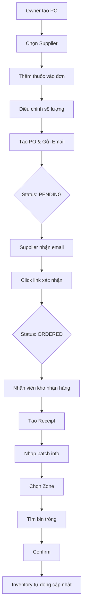

# Purchase Order Quick Guide - Hướng Dẫn Nhanh Nhập Hàng

## 🎯 Tóm Tắt Quy Trình



---

## 📝 Checklist Từng Bước

### ✅ Bước 1: Owner Tạo Purchase Order

**Người thực hiện:** Owner / Manager

**Thao tác:**

1. Vào màn hình **Purchase Orders** → Click **"Create Purchase Order"**
2. **Chọn Supplier** từ dropdown
3. **Nhập ngày dự kiến giao hàng** (Expected Delivery Date)
4. **Thêm thuốc:**
   - Click **"Add Medication"**
   - Chọn thuốc từ danh sách của supplier
   - Nhập số lượng (quantity)
   - Giá sẽ tự động lấy từ supplier price
5. **Kiểm tra tổng tiền** (Total Amount)
6. Click **"Create & Send Email"**

**Kết quả:**

- ✓ Purchase Order được tạo với status = `pending`
- ✓ Email tự động gửi đến supplier với link xác nhận
- ✓ Owner nhận thông báo tạo PO thành công

**API:**

```http
POST /api/purchases
Content-Type: application/json

{
  "supplier_id": "uuid-supplier",
  "expected_date": "2025-11-20",
  "items": [
    {
      "supplier_medication_variant_id": "uuid-variant",
      "quantity": 100,
      "unit_price": 50000
    }
  ]
}
```

---

### ✅ Bước 2: Supplier Xác Nhận Đơn Hàng

**Người thực hiện:** Supplier (Nhà cung cấp)

**Thao tác:**

1. **Mở email** nhận được từ PharmaFlow
2. **Đọc chi tiết đơn hàng:**
   - Order Number
   - Danh sách thuốc
   - Số lượng, giá
   - Ngày giao hàng dự kiến
3. **Click button** "Confirm Receipt of Purchase Order"
4. Được redirect đến trang xác nhận thành công

**Kết quả:**

- ✓ Purchase Order status chuyển từ `pending` → `ordered`
- ✓ Owner nhận email thông báo supplier đã xác nhận
- ✓ Đơn hàng sẵn sàng để supplier chuẩn bị và giao

**API:**

```http
GET /api/purchases/confirm/:purchaseOrderId?token=abc123...
```

---

### ✅ Bước 3: Nhân Viên Kho Nhận Hàng

**Người thực hiện:** Warehouse Staff

**Thao tác:**

1. Vào **Purchase Orders** → Tìm PO có status = `ordered`
2. Click **"Receive Goods"** / **"Create Receipt"**
3. **Nhập thông tin nhận hàng:**
   - Received Date (mặc định: hôm nay)
   - Received By (tự động: user hiện tại)
4. **Chọn Zone để lưu trữ** (Storage Zone)
5. **Nhập thông tin từng item:**

   | Field | Mô Tả | Bắt Buộc |
   |-------|-------|----------|
   | Received Quantity | Số lượng thực tế nhận | ✓ |
   | Batch Number | Số lô (VD: LOT-2025-001) | ✓ |
   | Manufacture Date | Ngày sản xuất | ✓ |
   | Expiry Date | Ngày hết hạn | ✓ |

6. Click **"Find Available Bins"** để tìm ô trống trong zone
7. **Xem bin được gợi ý** cho từng item
8. Click **"Confirm & Create Receipt"**

**Kết quả:**

- ✓ Receipt được tạo
- ✓ Inventory tự động cập nhật (hàng vào kho)
- ✓ Mỗi item được phân bổ vào bin trống theo FIFO
- ✓ Có thể xem inventory allocation details

**API:**

```http
# Bước 1: Tìm bins trống
POST /api/inventory/find-available-bins
{
  "zoneId": "uuid-zone",
  "items": [
    { "medicationVariantId": "uuid-var-1", "quantity": 100 },
    { "medicationVariantId": "uuid-var-2", "quantity": 50 }
  ]
}

# Bước 2: Tạo Receipt
POST /api/purchases/:purchaseOrderId/receipts
{
  "receivedDate": "2025-11-15T10:00:00Z",
  "receivedBy": "uuid-user",
  "items": [
    {
      "purchaseOrderItemId": "uuid-item-1",
      "quantity": 100,
      "batchNumber": "LOT-001",
      "manufactureDate": "2025-10-01",
      "expiryDate": "2027-10-01",
      "binId": "uuid-bin-a01"
    }
  ]
}
```

---

### ✅ Bước 4: Hệ Thống Tự Động Phân Bổ

> Diễn ra tự động khi tạo Receipt

**Quy tắc phân bổ (FIFO - First In First Out):**

1. **Ưu tiên bin trống** trong zone đã chọn
2. **Sắp xếp bin theo thứ tự:**
   - Zone Code (A → Z)
   - Rack Code (R01 → R02 → ...)
   - Bin Level (1 → 2 → 3 → ...)
   - Bin Number (1 → 2 → 3 → ...)
3. **Chọn bin đầu tiên** trong danh sách
4. **Tạo inventory record** với thông tin:
   - Medication Variant ID
   - Batch Number
   - Manufacture Date / Expiry Date
   - Quantity
   - Bin ID (location)

**Ví dụ phân bổ:**

```text
Zone A (Thuốc thường) - 20 bins
├── R01 (Rack 1)
│   ├── A01 [EMPTY] ← Paracetamol LOT-001 sẽ vào đây (bin đầu tiên)
│   ├── A02 [EMPTY] ← Amoxicillin LOT-002 sẽ vào đây (bin thứ 2)
│   └── A03 [EMPTY]
└── R02 (Rack 2)
    ├── A04 [EMPTY]
    └── A05 [EMPTY]
```

---

## 🔍 Các Trường Hợp Đặc Biệt

### 📦 Trường Hợp 1: Nhận Thiếu Hàng

**Tình huống:** Owner đặt 100 boxes, nhưng supplier chỉ giao 80 boxes

**Giải pháp:**

- Nhập `Received Quantity = 80` thay vì 100
- Hệ thống sẽ tạo inventory với 80 boxes
- PO giữ nguyên ordered quantity = 100
- Có thể tạo thêm receipt sau cho 20 boxes còn lại

### 🏭 Trường Hợp 2: Nhiều Lô Cùng Một Thuốc

**Tình huống:** Nhận 100 boxes Paracetamol nhưng có 2 lô khác nhau

**Giải pháp:**

- Tách thành 2 items riêng trong receipt
- Mỗi lô có batch number, expiry date riêng
- Hệ thống phân bổ vào 2 bins khác nhau

```javascript
{
  "items": [
    {
      "purchaseOrderItemId": "item-1",
      "quantity": 50,
      "batchNumber": "LOT-001",
      "expiryDate": "2027-10-01"
    },
    {
      "purchaseOrderItemId": "item-1", // Cùng item
      "quantity": 50,
      "batchNumber": "LOT-002", // Khác lô
      "expiryDate": "2027-12-01"
    }
  ]
}
```

### 🏬 Trường Hợp 3: Zone Đã Đầy

**Tình huống:** Không còn bin trống trong zone đã chọn

**Giải pháp:**

1. **Option 1:** Chọn zone khác
2. **Option 2:** Phân bổ vào bin có hàng (nếu chấp nhận)
3. **Option 3:** Tạo thêm bins trong rack (cần quyền admin)

---

## 📊 Trạng Thái Purchase Order

| Status | Mô Tả | Ai Thực Hiện | Hành Động Tiếp Theo |
|--------|-------|--------------|---------------------|
| `pending` | Đang chờ supplier xác nhận | System (sau khi tạo PO) | Supplier click confirm link |
| `ordered` | Supplier đã xác nhận | Supplier (click email) | Chuẩn bị hàng và giao |
| `received` | Đã nhận hàng vào kho | Warehouse Staff (tạo receipt) | Có thể bán hàng |
| `cancelled` | Đơn hàng bị hủy | Owner | Email thông báo supplier |

---

## 🎨 Screenshots (UI Reference)

### Màn Hình Tạo Purchase Order

- [ ] Select Supplier dropdown
- [ ] Expected Delivery Date picker
- [ ] Add Medication button
- [ ] Items table với quantity, price
- [ ] Total Amount display
- [ ] Create & Send Email button

### Màn Hình Tạo Receipt

- [ ] PO Info readonly (supplier, order date, status)
- [ ] Received Date (default today)
- [ ] Storage Zone selector
- [ ] Find Available Bins button
- [ ] Items table với:
  - Ordered quantity (readonly)
  - Received quantity (input)
  - Batch number (input)
  - Manufacture date (date picker)
  - Expiry date (date picker)
  - Bin assignment (auto-filled after finding bins)
- [ ] Confirm & Create Receipt button

---

## 💡 Tips & Best Practices

### ✅ Nên Làm

1. **Kiểm tra kỹ thông tin PO** trước khi gửi email cho supplier
2. **Nhập đầy đủ batch info** khi nhận hàng (giúp truy xuất nguồn gốc)
3. **Chọn zone phù hợp** với loại thuốc (vd: thuốc kháng sinh, vitamin, ...)
4. **Xác nhận ngày hết hạn** > ngày sản xuất trước khi lưu
5. **Kiểm tra bin assignment** trước khi confirm receipt

### ❌ Không Nên

1. ❌ Tạo PO không có items
2. ❌ Bỏ trống batch number hoặc expiry date
3. ❌ Nhập received quantity > ordered quantity
4. ❌ Chọn bin không thuộc zone đã chọn
5. ❌ Tạo receipt cho PO chưa được confirm (status ≠ ordered)

---

## 🔗 Tài Liệu Chi Tiết

Xem thêm tài liệu đầy đủ tại:

- **[PURCHASE_ORDER_WORKFLOW_SCENARIO.md](./PURCHASE_ORDER_WORKFLOW_SCENARIO.md)** - Kịch bản chi tiết đầy đủ
- **[API_DOCUMENTATION.md](../ai/API_DOCUMENTATION.md)** - Chi tiết API endpoints
- **[INVENTORY_MANAGEMENT.md](./INVENTORY_MANAGEMENT.md)** - Quản lý tồn kho

---

## ❓ FAQs

**Q: Email gửi supplier không thành công, phải làm sao?**  
A: Email được gửi bất đồng bộ, PO vẫn tạo thành công. Bạn có thể gửi lại email thủ công hoặc liên hệ supplier qua điện thoại.

**Q: Supplier không click confirm link thì sao?**  
A: Link có hiệu lực 7 ngày. Sau đó cần tạo PO mới hoặc owner tự chuyển status thủ công (cần quyền admin).

**Q: Có thể sửa PO sau khi đã gửi không?**  
A: Có thể sửa nếu status vẫn là `pending`. Nếu đã `ordered`, cần hủy và tạo PO mới.

**Q: Nhận thiếu hàng thì nhập thế nào?**  
A: Nhập đúng số lượng thực tế nhận. Sau đó có thể tạo receipt bổ sung khi nhận đủ.

**Q: Một PO có thể tạo nhiều receipts không?**  
A: Có, ví dụ nhận hàng nhiều lần (partial delivery).

**Q: Làm sao biết hàng đã vào kho ở đâu?**  
A: Xem inventory allocation trong receipt details hoặc inventory management.

---

**Last Updated:** 15/11/2025  
**Version:** 1.0  
**Author:** GitHub Copilot
